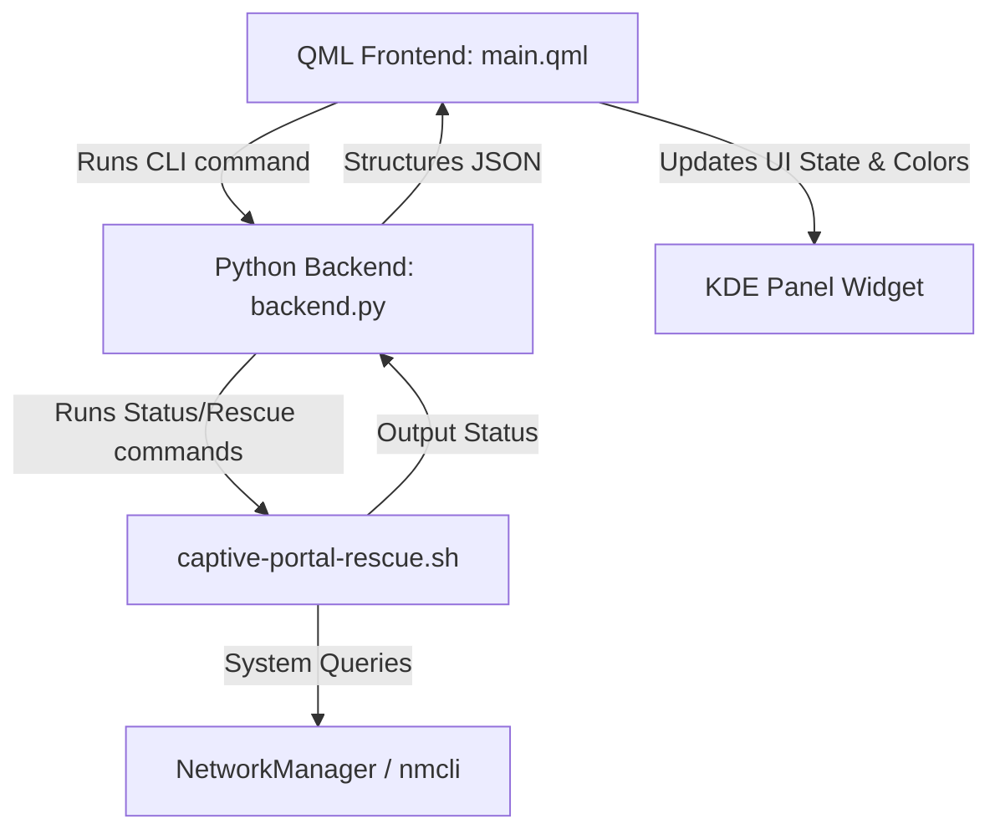

# Development Guide: Captive Portal Rescue Widget

This guide provides technical information about the architecture, local testing, and release packaging for the **Captive Portal Rescue Widget**.

---

## 📂 Architecture Overview

The widget employs a decoupled frontend-backend architecture:

1. **Frontend (QML):** Located in `contents/ui/main.qml`, it renders the native KDE Plasma interface using Kirigami and Plasma components.
2. **Backend (Python):** Located in `contents/ui/backend.py`, it executes status queries and calls the core shell script (`captive-portal-rescue.sh`) to perform DNS/NetworkManager profile modifications.



### Communication Flow
* The QML frontend uses KDE's `Plasma5Support.DataSource` (with the `executable` engine) to run the backend script asynchronously.
* The script is executed as:
  ```bash
  python3 contents/ui/backend.py --status
  ```
* The stdout from the Python script is captured, parsed as JSON in JavaScript, and bound to reactive QML properties (`root.status`, `root.vpnActive`, etc.).

---

## 🛠️ Development Workflow

To make modifications and see them live:

1. **Clone/create the repository** in your development directory:
   ```bash
   git clone https://github.com/KnowOneActual/org.fedora.captiveportal.git ~/github/org.fedora.captiveportal
   ```
2. **Create a symbolic link** in the Plasma local plasmoids directory:
   ```bash
   ln -s ~/github/org.fedora.captiveportal ~/.local/share/plasma/plasmoids/org.fedora.captiveportal
   ```
3. **Restart the plasmashell** to load the new widget:
   ```bash
   systemctl --user restart plasma-plasmashell
   ```

---

## 🧪 Testing & Debugging

### 1. Testing the Python Backend
You can run the backend script directly in your terminal to verify interface detection, DNS checks, and JSON outputs:

```bash
# Test status check (JSON output)
python3 contents/ui/backend.py --status

# Test rescue flow (triggers nmcli modifications)
python3 contents/ui/backend.py --rescue

# Test restore flow (reverts DNS settings)
python3 contents/ui/backend.py --restore
```

### 2. Inspecting Logs
To view QML warnings, `console.log()` outputs, or Python runtime tracebacks, inspect the systemd user journal:

```bash
journalctl --user -f -u plasma-plasmashell
```

---

## 📦 Packaging for Release

To build the final `.plasmoid` package for distribution:

1. Ensure you are in the root directory of the project.
2. Run the `zip` command containing only the necessary runtime files (excluding `.git`, docs, and backup packages):
   ```bash
   zip -r org.fedora.captiveportal.plasmoid metadata.json contents/
   ```
3. Test installing the newly generated package:
   ```bash
   # Remove existing
   kpackagetool6 --type Plasma/Applet --remove org.fedora.captiveportal
   # Install new
   kpackagetool6 --type Plasma/Applet --install org.fedora.captiveportal.plasmoid
   ```
